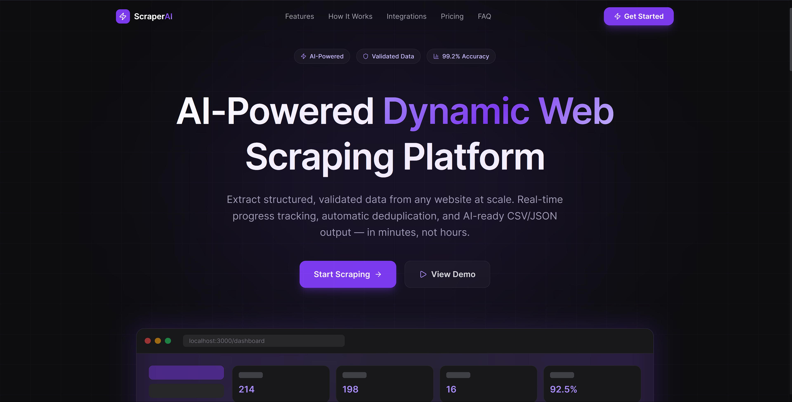
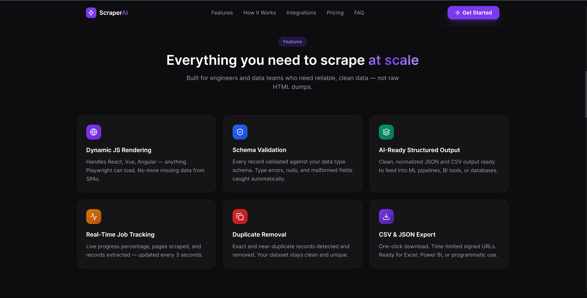
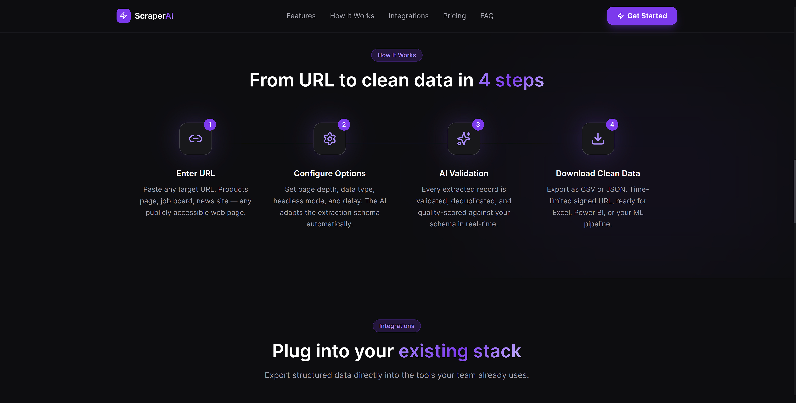
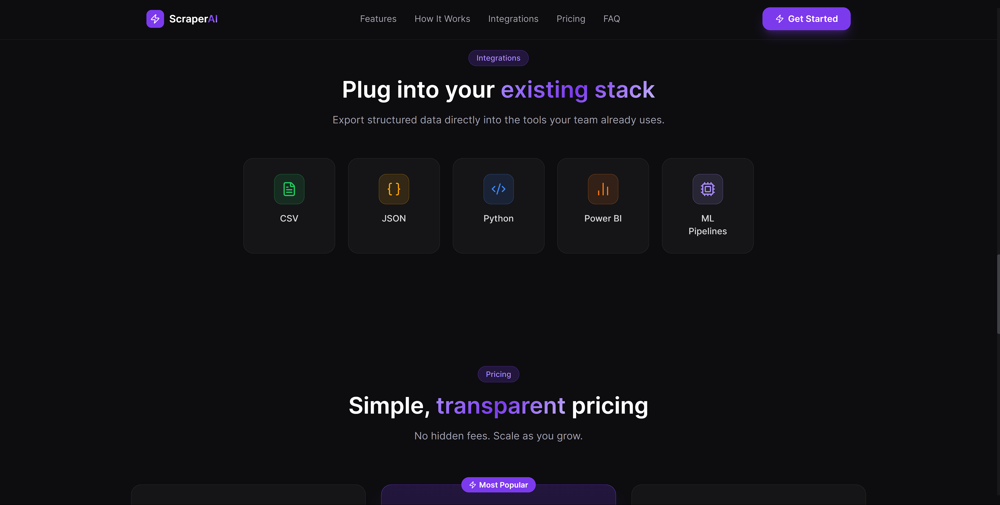

# 🚀 Dynamic Web Scraper

A production-ready full-stack web scraping platform built with **React + TypeScript (Vite)** and **FastAPI (Python)**.

It features a contract-driven REST API architecture, real-time job tracking, structured result validation, and a modern dark-themed dashboard for managing scraping operations.

---

## 📸 Screenshots

### Landing Page


### Dashboard


### Job History


### Features


### How it Works


### Integrations


---

## ✨ Features

| Feature | Description |
|----------|-------------|
| 🎯 **Job Management** | Submit, track, and manage scraping jobs via dashboard |
| 📊 **Real-time Tracking** | Live progress polling with percentage completion |
| 📜 **Job History** | Paginated view of all scraping operations |
| 🔒 **Contract-Driven API** | Strict schema alignment between frontend & backend |
| 📈 **Data Quality Scoring** | Automated validation scoring for extracted datasets |
| ⬇️ **Export Results** | Download structured CSV output (mock implementation) |
| 📚 **Swagger Docs** | Interactive API documentation at `/docs` |
| 🎨 **Modern UI** | Responsive dark theme built with Tailwind CSS |

---

## ⚙️ How It Works

### 1️⃣ Submit a Scraping Job

Frontend sends:

```json
POST /scrape
{
  "url": "https://example.com",
  "data_type": "products",
  "pages": 5,
  "headless": true
}
```

Backend:
- Validates request using Pydantic
- Generates a unique `job_id`
- Simulates scraping process
- Stores job in memory

---

### 2️⃣ Poll Job Status

Frontend polls:

```http
GET /status/{job_id}
```

Example Response:

```json
{
  "success": true,
  "status": "completed",
  "progress_percentage": 100,
  "records_extracted": 150
}
```

---

### 3️⃣ View Results

```http
GET /result/{job_id}
```

Returns:
- Total records
- Clean records
- Data quality breakdown
- Download URL

---

### 4️⃣ View Job History

```http
GET /history
```

Returns paginated job summaries for dashboard display.

---

## 🏗 Tech Stack

### Frontend
- React 18
- TypeScript
- Vite
- Tailwind CSS
- Axios
- Framer Motion

### Backend
- FastAPI
- Python 3.11+
- Pydantic
- Uvicorn

---

## 🔌 Integrations

| Integration | Purpose |
|-------------|----------|
| Swagger UI | Interactive API exploration at `/docs` |
| OpenAPI Schema | Auto-generated API documentation |
| CORS Middleware | Secure frontend-backend communication |
| Axios Service Layer | Centralized API request management |
| Contract-Driven Architecture | Ensures strict schema alignment |

---

## 📂 Project Structure

```
Dynamic-Web-Scraper/
│
├── frontend/
│   ├── src/
│   │   ├── components/
│   │   ├── pages/
│   │   ├── services/
│   │   │   └── api.ts
│   │   └── hooks/
│   ├── package.json
│   └── vite.config.ts
│
├── backend/
│   ├── main.py
│   └── requirements.txt
│
└── README.md
```

---

## 🚀 Getting Started

### Prerequisites

- Python 3.11+
- Node.js 18+
- Git

---

### Backend Setup

```bash
cd backend

python -m venv venv
venv\Scripts\activate   # Windows
# source venv/bin/activate  # macOS/Linux

pip install -r requirements.txt

python -m uvicorn main:app --reload --port 8000
```

API Documentation:

```
http://localhost:8000/docs
```

---

### Frontend Setup

```bash
cd frontend
npm install
npm run dev
```

Application runs at:

```
http://localhost:3000
```

---

## 🧠 Current Version

This version uses a **mock scraping engine** to demonstrate full-stack workflow and API contract alignment.

---

## 🛣 Roadmap

- [ ] Replace mock engine with Selenium or Playwright
- [ ] Add CSV file generation
- [ ] Add PostgreSQL database persistence
- [ ] Implement background job queue (Celery/Redis)
- [ ] Add JWT authentication
- [ ] Dockerize full stack
- [ ] Deploy to cloud infrastructure

---

## 👨‍💻 Author

**Ankit Kumar**  
📧 arsonnick349@gmail.com  
🐙 GitHub: arsonic-dev

---

## ⭐ If You Like This Project

Star the repository and follow the development journey 🚀
